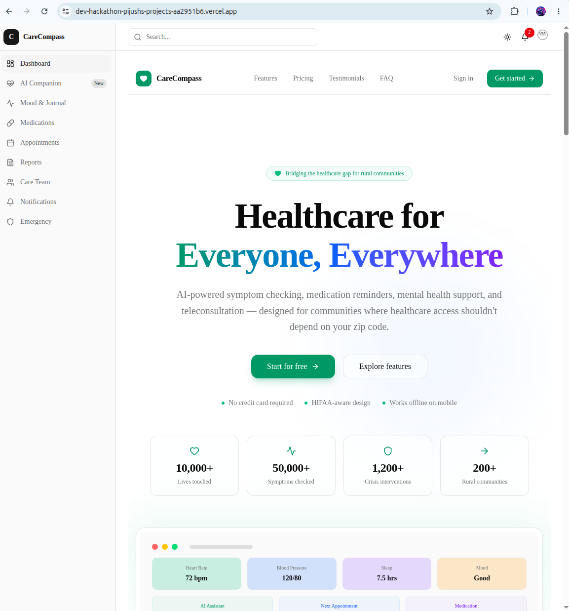
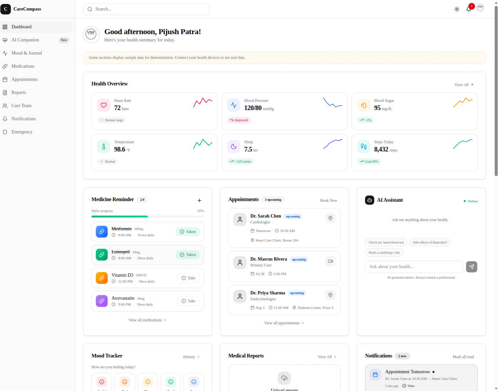
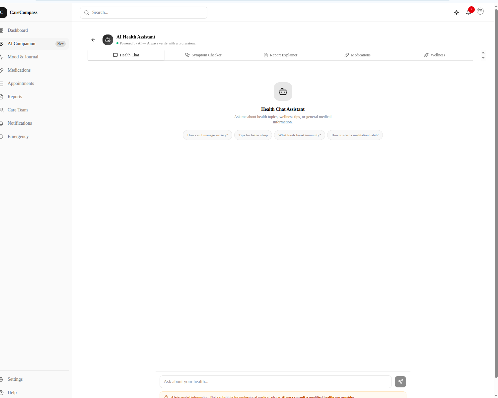
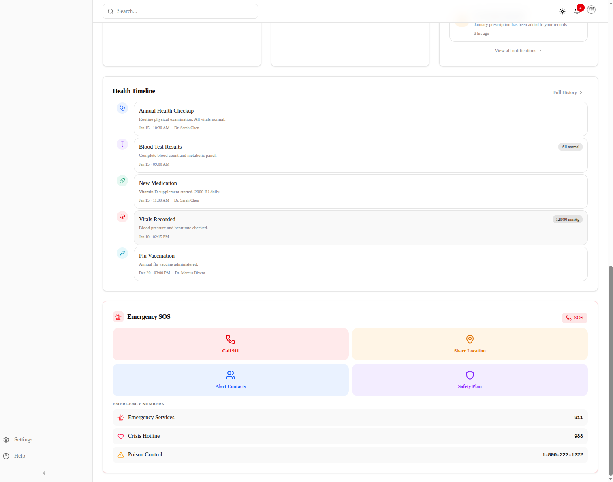

# CareCompass

**Rural Health Access & Mental Wellness PWA** — AI-powered healthcare assistant with crisis detection, medical report analysis, provider directory, and community support groups.

[](https://nextjs.org)
[](https://typescriptlang.org)
[](https://supabase.com)
[](https://tailwindcss.com)
[](LICENSE)

---

## Overview

CareCompass is a progressive web application designed to bridge the healthcare gap in rural and underserved communities. It combines AI-driven mental health support, medical record management, and provider discovery into a single, accessible platform.

**Key differentiators:**
- Real-time crisis detection with two-pass AI analysis (keyword + LLM) and automatic resource escalation
- Medical report upload with OCR (PDF + image), AI-powered analysis, and longitudinal health summaries
- Multi-provider AI chat (OpenAI, Google Gemini, Anthropic Claude) with therapeutic system prompts
- Provider directory with PostGIS geospatial search, insurance network filtering, and sliding-scale fee support
- Row-level security on every table — users can only access their own health data

---

## Features

### Authentication & Onboarding
- Email/password + Google OAuth via Supabase Auth
- Multi-step onboarding: consent, goals, crisis contacts
- Rate-limited auth endpoints (10 req/min per IP)
- Session persistence with SSR cookie-based management

### AI Healthcare Assistant
- **Therapeutic Chat** — conversational mental health support with crisis interception
- **Symptom Checker** — structured symptom analysis with severity, urgency, and specialist recommendations
- **Report Explainer** — plain-language explanation of medical reports with key findings
- **Medication Guidance** — drug interaction checks and dosage information
- **Wellness Suggestions** — personalized self-care recommendations

### Medical Reports
- Upload PDFs and images (JPG, PNG, TIFF, WebP)
- Server-side text extraction via `pdf-parse` (PDF) and `tesseract.js` (OCR)
- Automatic AI analysis on upload
- Longitudinal health summary aggregating findings across reports
- Re-analysis capability for updated AI insights

### Provider Directory
- Search by specialty, location (PostGIS), language, insurance network
- Provider profiles with credentials, availability, and reviews
- Appointment booking with confirmation and cancellation
- Telehealth and in-person visit support

### Crisis Safety
- Two-pass crisis detection: keyword matching + LLM analysis with Zod validation
- Automatic escalation to crisis resources (988 Lifeline, Crisis Text Line)
- Safety plan management with warning signs, coping strategies, and contacts
- Crisis alert logging with resolution tracking

### Community
- Support groups by category (anxiety, depression, grief, addiction, chronic pain, caregivers)
- Group messaging with reactions and pinned messages
- Role-based access (admin, moderator, member)

### PWA & Offline
- Web app manifest with install prompt
- Service worker stub for offline caching (extensible)
- Responsive design for mobile, tablet, and desktop

---

## Tech Stack

| Layer | Technology |
|---|---|
| **Framework** | Next.js 16 (App Router, Turbopack, standalone output) |
| **Language** | TypeScript 5 (strict mode) |
| **Auth** | Supabase Auth (Email + Google OAuth) |
| **Database** | PostgreSQL via Supabase with PostGIS, Row-Level Security |
| **Cache / Rate Limiting** | Upstash Redis (REST API) |
| **AI** | Vercel AI SDK (`ai` v7) + OpenAI + Google Gemini + Anthropic Claude |
| **Payments** | Razorpay (INR, with `timingSafeEqual` verification) |
| **Email** | Resend (transactional email with HTML templates) |
| **PDF Parsing** | `pdf-parse` v2 (class-based API) |
| **OCR** | `tesseract.js` v7 (client-side image text extraction) |
| **UI Components** | shadcn/ui (Radix UI + Base UI + Tailwind CSS v4) |
| **Styling** | Tailwind CSS v4, `tw-animate-css`, `class-variance-authority` |
| **Animations** | Framer Motion + CSS keyframes |
| **Forms** | React Hook Form + Zod v4 validation |
| **Icons** | Lucide React (tree-shakeable) |
| **Theme** | `next-themes` (dark/light mode) |
| **Monitoring** | Vercel Speed Insights |
| **Pre-commit** | Husky + lint-staged |

---

## Architecture

```
┌─────────────────────────────────────────────────────────────┐
│                         CLIENT                              │
│  Next.js 16 App Router  ·  React 19  ·  Tailwind CSS v4    │
│  shadcn/ui  ·  Framer Motion  ·  Service Worker (PWA)      │
└────────────────────────────┬────────────────────────────────┘
                             │
                    ┌────────▼────────┐
                    │   proxy.ts      │  ← Middleware (Next.js 16 convention)
                    │  Auth routing   │
                    │  Rate limiting  │
                    │  Session refresh│
                    └────────┬────────┘
                             │
              ┌──────────────┼──────────────┐
              │              │              │
     ┌────────▼──────┐ ┌────▼────┐ ┌───────▼───────┐
     │ Server Actions │ │ API     │ │  RSC / SSR    │
     │  lib/actions/  │ │ Routes  │ │  Page render  │
     └────────┬──────┘ └────┬────┘ └───────┬───────┘
              │              │              │
              └──────────────┼──────────────┘
                             │
         ┌───────────────────┼───────────────────┐
         │                   │                   │
┌────────▼────────┐ ┌───────▼────────┐ ┌────────▼────────┐
│     Supabase     │ │   Upstash      │ │   AI Providers  │
│  PostgreSQL +    │ │   Redis        │ │  OpenAI GPT-4o  │
│  Auth + Storage  │ │  Rate limiting │ │  Google Gemini  │
│  RLS on 18 tables│ │  Session cache │ │  Anthropic      │
└──────────────────┘ └────────────────┘ └─────────────────┘
```

---

## Folder Structure

```
website/
├── app/
│   ├── (dashboard)/              # Protected dashboard route group
│   │   ├── page.tsx              # Main dashboard (9-section grid)
│   │   ├── layout.tsx            # Sidebar + navbar layout
│   │   ├── care/
│   │   │   ├── page.tsx          # Care overview
│   │   │   └── reports/
│   │   │       └── page.tsx      # Medical reports (upload + list + summary)
│   │   ├── chat/
│   │   │   └── page.tsx          # AI Healthcare Assistant
│   │   ├── community/
│   │   │   └── page.tsx          # Support groups
│   │   ├── crisis/
│   │   │   └── page.tsx          # Crisis resources & safety plan
│   │   ├── mood/
│   │   │   └── page.tsx          # Mood & wellness tracker
│   │   └── settings/
│   │       └── page.tsx          # User settings
│   ├── (onboarding)/             # Onboarding route group
│   │   ├── consent/page.tsx
│   │   ├── crisis-contacts/page.tsx
│   │   └── goals/page.tsx
│   ├── auth/                     # Authentication pages
│   │   ├── login/page.tsx
│   │   ├── signup/page.tsx
│   │   ├── forgot-password/page.tsx
│   │   ├── reset-password/page.tsx
│   │   ├── verify-email/page.tsx
│   │   └── callback/route.ts     # OAuth callback handler
│   ├── api/                      # API routes
│   │   ├── ai/                   # AI endpoints (chat, crisis-check, insights)
│   │   ├── appointments/         # Booking, cancellation, webhooks
│   │   ├── crisis/               # Crisis logging & resources
│   │   ├── health/               # Health check endpoint
│   │   ├── notifications/        # Push notification send & preferences
│   │   ├── providers/            # Provider search & availability
│   │   └── webhooks/             # Cron jobs, Resend, Stripe webhooks
│   ├── profile/page.tsx          # User profile
│   ├── test/supabase/page.tsx    # Supabase connection diagnostics
│   ├── layout.tsx                # Root layout (fonts, metadata, ThemeProvider)
│   ├── page.tsx                  # Landing page (dynamic imports)
│   ├── globals.css               # Global styles + Tailwind v4
│   ├── loading.tsx               # Root loading skeleton
│   └── error.tsx                 # Global error boundary
├── components/
│   ├── chat/                     # Chat UI (ChatWindow, CrisisInterceptor, MessageBubble)
│   ├── dashboard/                # Dashboard sections (9 cards), sidebar, navbar
│   │   └── sections/             # ai-assistant, appointments, health-overview, etc.
│   ├── healthcare/               # Domain components
│   │   ├── forms/                # Symptom, appointment, patient, medicine forms
│   │   ├── tables/               # Data tables (appointments, doctors, medicines)
│   │   ├── report-*.tsx          # Upload, list, analysis, explainer
│   │   ├── symptom-checker.tsx
│   │   ├── ai-chat-window.tsx
│   │   └── health-summary-card.tsx
│   ├── landing/                  # Hero, features, pricing, testimonials, FAQ, footer
│   ├── shared/                   # GoogleIcon, SpeedInsightsProvider
│   ├── ui/                       # 21 shadcn/ui primitives
│   ├── theme-provider.tsx
│   └── toaster.tsx
├── hooks/
│   ├── useChat.ts                # Chat + symptom + report + medication + wellness hooks
│   └── useReports.ts             # Report CRUD + health summary hooks
├── lib/
│   ├── actions/                  # Server actions
│   │   ├── auth.ts               # signIn, signUp, signOut, forgotPassword, resetPassword
│   │   ├── chat.ts               # AI actions (5 functions, all auth-guarded)
│   │   ├── reports.ts            # Report upload, list, delete, reanalyze, summary
│   │   ├── mood.ts, appointments.ts, notifications.ts, groups.ts, safety-plan.ts
│   ├── ai/                       # AI layer
│   │   ├── functions.ts          # chat(), analyzeSymptoms(), explainMedicalReport(), etc.
│   │   ├── schemas.ts            # Zod schemas for structured AI responses
│   │   ├── system-prompts.ts     # System prompts (therapeutic, crisis, symptom, etc.)
│   │   ├── crisis-detection.ts   # Two-pass crisis detection (keyword + LLM + Zod)
│   │   ├── provider.ts           # AIProvider interface
│   │   └── openai-provider.ts    # OpenAI provider implementation
│   ├── supabase/
│   │   ├── server.ts             # Server-side client (SSR cookies)
│   │   ├── client.ts             # Browser client
│   │   ├── admin.ts              # Service role client (admin operations)
│   │   └── middleware.ts         # Session refresh, auth routing, rate limiting
│   ├── validations/              # Zod schemas (auth, chat, mood, report, provider, safety-plan)
│   ├── push.ts                   # Push notification (VAPID, SSR-safe)
│   ├── razorpay.ts               # Payment creation & verification
│   ├── redis.ts                  # Upstash Redis helpers + rate limiting
│   ├── resend.ts                 # Email service (welcome, verification, password reset)
│   └── utils.ts                  # cn() helper, formatters
├── supabase/
│   └── migrations/               # 6 SQL migration files
│       ├── 001_initial_schema.sql    # 12 core tables
│       ├── 002_rls_policies.sql      # 40+ RLS policies
│       ├── 003_crisis_tables.sql     # safety_plans, crisis_resources, crisis_alerts
│       ├── 004_providers.sql         # provider_reviews, provider_availability
│       ├── 005_community.sql         # groups, group_members, group_messages, reactions
│       └── 006_functions.sql         # Triggers, auto-profile creation, indexes (80+)
├── public/
│   ├── manifest.json             # PWA manifest
│   ├── sw.js                     # Service worker stub
│   ├── robots.txt                # SEO robots
│   └── favicon.ico
├── proxy.ts                      # Next.js 16 middleware (replaces middleware.ts)
├── next.config.ts                # Standalone output, CSP, security headers
├── tsconfig.json                 # Strict mode, bundler resolution
├── Dockerfile                    # Multi-stage build (node:20-alpine)
├── .env.example                  # All environment variables documented
└── package.json
```

---

## Installation

### Prerequisites

- **Node.js** 20+ (推荐 20 LTS)
- **npm** 10+
- **Supabase** project (free tier works)
- **Upstash Redis** account (free tier works)
- **AI provider API key** (at least one: OpenAI, Google, or Anthropic)

### Quick Start

```bash
# 1. Clone the repository
git clone https://github.com/your-org/carecompass.git
cd carecompass/website

# 2. Install dependencies
npm install

# 3. Configure environment
cp .env.example .env.local
# Edit .env.local with your keys (see Environment Variables below)

# 4. Run database migrations
# Go to Supabase Dashboard → SQL Editor → New query
# Paste and run each file in order:
#   supabase/migrations/001_initial_schema.sql
#   supabase/migrations/002_rls_policies.sql
#   ... through 006_functions.sql

# 5. Create Storage bucket
# Supabase Dashboard → Storage → New bucket
# Name: medical-reports
# Public: yes

# 6. Start development server
npm run dev
```

Open [http://localhost:3000](http://localhost:3000).

---

## Environment Variables

Copy `.env.example` to `.env.local` and fill in the values:

```env
# ── Supabase (required) ─────────────────────────────────────
NEXT_PUBLIC_SUPABASE_URL=https://your-project.supabase.co
NEXT_PUBLIC_SUPABASE_ANON_KEY=eyJ...
SUPABASE_SERVICE_ROLE_KEY=eyJ...

# ── Site URL ────────────────────────────────────────────────
NEXT_PUBLIC_SITE_URL=http://localhost:3000

# ── Upstash Redis (required for rate limiting) ──────────────
UPSTASH_REDIS_REST_URL=https://your-instance.upstash.io
UPSTASH_REDIS_REST_TOKEN=AVe...

# ── AI Provider (at least one required) ─────────────────────
OPENAI_API_KEY=sk-...
GOOGLE_API_KEY=...
ANTHROPIC_API_KEY=sk-ant-...

# ── Razorpay (optional — for payments) ─────────────────────
RAZORPAY_KEY_ID=rzp_test_...
RAZORPAY_KEY_SECRET=...

# ── Resend (optional — for email) ──────────────────────────
RESEND_API_KEY=re_.....
EMAIL_FROM=noreply@yourdomain.com

# ── Push Notifications (optional) ──────────────────────────
NEXT_PUBLIC_VAPID_PUBLIC_KEY=...
VAPID_PRIVATE_KEY=...
```

| Variable | Required | Description |
|---|---|---|
| `NEXT_PUBLIC_SUPABASE_URL` | Yes | Supabase project URL |
| `NEXT_PUBLIC_SUPABASE_ANON_KEY` | Yes | Supabase anonymous/public key |
| `SUPABASE_SERVICE_ROLE_KEY` | Yes | Supabase service role key (server-side only) |
| `NEXT_PUBLIC_SITE_URL` | Yes | Base URL for redirects and email links |
| `UPSTASH_REDIS_REST_URL` | Yes | Upstash Redis REST endpoint |
| `UPSTASH_REDIS_REST_TOKEN` | Yes | Upstash Redis auth token |
| `OPENAI_API_KEY` | No* | OpenAI API key for GPT-4o |
| `GOOGLE_API_KEY` | No* | Google AI Studio / Gemini API key |
| `ANTHROPIC_API_KEY` | No* | Anthropic API key for Claude |
| `RAZORPAY_KEY_ID` | No | Razorpay test/live key ID |
| `RAZORPAY_KEY_SECRET` | No | Razorpay key secret |
| `RESEND_API_KEY` | No | Resend API key for transactional email |
| `EMAIL_FROM` | No | Sender email address |

*\*At least one AI provider key is required for the AI features to function.*

---

## Supabase Setup

### 1. Create Project
1. Go to [supabase.com](https://supabase.com) → New Project
2. Note your **Project URL** and **API keys** (anon + service role)

### 2. Run Migrations
Go to **SQL Editor** → **New query** and run each migration file in order:

```
supabase/migrations/001_initial_schema.sql   → 12 core tables
supabase/migrations/002_rls_policies.sql     → 40+ RLS policies
supabase/migrations/003_crisis_tables.sql    → Safety & crisis tables
supabase/migrations/004_providers.sql        → Provider reviews & availability
supabase/migrations/005_community.sql        → Groups & messaging
supabase/migrations/006_functions.sql        → Triggers, indexes, auto-profile
```

### 3. Create Storage Bucket
1. Go to **Storage** → **New bucket**
2. Name: `medical-reports`
3. Public bucket: **Yes**
4. File size limit: 10MB (recommended)
5. Allowed MIME types: `application/pdf`, `image/jpeg`, `image/png`, `image/tiff`, `image/webp`

### 4. Enable Google OAuth (optional)
1. Go to **Authentication** → **Providers** → **Google**
2. Enable and add your Google OAuth Client ID + Secret
3. Set Authorized redirect URI to: `https://your-project.supabase.co/auth/v1/callback`

### Database Tables

| Table | Purpose |
|---|---|
| `profiles` | Extended user data (extends `auth.users`) |
| `patients` | Clinical records linked to profiles |
| `providers` | Healthcare provider directory (with PostGIS) |
| `appointments` | Patient-provider appointments |
| `medical_reports` | Uploaded reports with AI summaries |
| `medications` | Prescribed medications |
| `medicine_logs` | Adherence tracking |
| `mental_health_logs` | Mood, energy, anxiety, sleep entries |
| `notifications` | In-app notifications |
| `chat_sessions` | AI conversation sessions |
| `chat_messages` | Individual chat messages |
| `emergency_contacts` | User-defined emergency contacts |
| `safety_plans` | Crisis safety plans |
| `crisis_resources` | Static crisis hotline data |
| `crisis_alerts` | Crisis event logging |
| `provider_reviews` | Provider ratings and reviews |
| `provider_availability` | Weekly availability schedules |
| `groups` | Support groups |
| `group_members` | Group membership |
| `group_messages` | Group chat messages |
| `group_message_reactions` | Emoji reactions |

---

## Redis Setup

CareCompass supports two Redis modes for rate limiting and caching.

### Option 1: Docker Redis (Recommended for Development)

No setup needed — Docker Compose provides a Redis 7 instance automatically.

```bash
docker compose up -d redis
redis-cli -h localhost ping  # PONG
```

### Option 2: Upstash Redis (Recommended for Production/Vercel)

For serverless deployments, use [Upstash Redis](https://upstash.com) (pay-per-request):

1. Go to [upstash.com](https://upstash.com) → Sign up (free tier: 10,000 commands/day)
2. Create a new Redis database (any region)
3. Copy the **REST URL** and **REST Token** from your database dashboard
4. Set in Vercel: `UPSTASH_REDIS_REST_URL` and `UPSTASH_REDIS_REST_TOKEN`

### Rate Limiting Configuration
The rate limiter is configured in `lib/supabase/middleware.ts`:
- **Auth endpoints** (`/auth/login`, `/auth/signup`): 10 requests per minute per IP
- Uses sliding window counter via `redisIncr()` with TTL
- If Redis is not configured, rate limiting is silently disabled (app continues to work)

---

## AI Setup

### Provider Configuration
CareCompass supports three AI providers via the [Vercel AI SDK](https://sdk.vercel.ai):

| Provider | Model | Env Variable |
|---|---|---|
| OpenAI | GPT-4o | `OPENAI_API_KEY` |
| Google | Gemini 2.0 Flash | `GOOGLE_API_KEY` |
| Anthropic | Claude 3.5 Sonnet | `ANTHROPIC_API_KEY` |

The default provider is determined by `AI_PROVIDER` env var (defaults to `openai`).

### AI Features
- **Crisis Detection** — Two-pass: keyword matching → LLM analysis with Zod-validated response + fail-safe fallback
- **Therapeutic Chat** — System prompt with safety boundaries, escalation protocols
- **Symptom Analysis** — Structured JSON response with severity, urgency, specialist type
- **Report Explanation** — Plain-language breakdown of medical terminology
- **Medication Guidance** — Drug information with interaction warnings

### Safety Guarantees
- All AI responses are validated against Zod schemas before use
- Crisis detection fails to `riskLevel: "moderate"` on any error (safe default)
- AI explicitly disclaims being a medical professional
- Crisis keywords trigger immediate resource display without waiting for LLM

---

## Local Development

```bash
# Start dev server (Turbopack)
npm run dev

# The app runs at http://localhost:3000
```

### Development Features
- Hot reload with Turbopack
- Skeleton loading states on all pages
- Supabase connection test at `/test/supabase` (auth-protected)
- Dark/light theme toggle

---

## Docker

### Quick Start (Docker Compose)

```bash
# 1. Copy and configure environment
cp .env.example .env.docker
# Edit .env.docker with your keys

# 2. Start all services (Nginx + Next.js + Redis)
docker compose up -d

# 3. Access the app
open http://localhost
```

This starts three containers:
- **Nginx** (port 80/443) — reverse proxy with caching, rate limiting, security headers
- **Next.js App** (internal port 3000) — the CareCompass application
- **Redis** (port 6379) — session cache and rate limiting

### Build and Run (Standalone)

```bash
# Build the image
docker build -t carecompass .

# Run the container
docker run -p 3000:3000 \
  -e NEXT_PUBLIC_SUPABASE_URL=https://your-project.supabase.co \
  -e NEXT_PUBLIC_SUPABASE_ANON_KEY=eyJ... \
  -e SUPABASE_SERVICE_ROLE_KEY=eyJ... \
  -e NEXT_PUBLIC_SITE_URL=https://your-domain.com \
  -e REDIS_URL=redis://host:6379 \
  -e OPENAI_API_KEY=sk-... \
  carecompass
```

### Docker Compose Services

```yaml
# docker-compose.yml
services:
  nginx:     # Reverse proxy — ports 80/443
  app:       # Next.js — internal port 3000
  redis:     # Cache — port 6379
```

### Multi-Stage Build
The Dockerfile uses a 3-stage build:
1. **deps** — Install production dependencies (`npm ci --omit=dev`)
2. **builder** — Build Next.js with `output: "standalone"`
3. **runner** — Minimal `node:20-alpine` with only the standalone output (~90MB)

### Container Management

```bash
# View logs
docker compose logs -f nginx
docker compose logs -f app
docker compose logs -f redis

# Restart a service
docker compose restart app

# Stop all services
docker compose down

# Stop and remove volumes
docker compose down -v

# Rebuild after code changes
docker compose up -d --build
```

---

## Nginx Configuration

Nginx sits in front of the Next.js app as a reverse proxy (`docker/nginx/`).

### Features
- **Reverse proxy** — forwards requests to the Next.js app
- **Gzip compression** — compresses text, JSON, XML, JavaScript, CSS, SVG, fonts
- **Static asset caching** — `/_next/static/` cached for 1 year (immutable), images for 30 days
- **Rate limiting** — 10 req/s for API endpoints, 5 req/min for auth endpoints
- **Security headers** — X-Frame-Options, X-Content-Type-Options, HSTS, CSP, Referrer-Policy
- **WebSocket support** — for Next.js HMR in development
- **Health check** — `GET /health` returns 200 OK

### Rate Limits
| Zone | Rate | Burst | Applied To |
|------|------|-------|------------|
| `api` | 10 req/s | 20 | `/api/*` |
| `auth` | 5 req/min | 3 | `/auth/*` |

### Cache Headers
| Path | Cache Duration | Notes |
|------|---------------|-------|
| `/_next/static/*` | 1 year | Immutable, content-hashed |
| `*.png, *.jpg, *.svg` | 30 days | Static assets |
| `/sw.js` | No cache | Service worker |
| `/manifest.json` | 1 day | PWA manifest |

---

## Redis Configuration

CareCompass supports two Redis modes:

### 1. Docker Redis (Local)
When running via Docker Compose, a local Redis 7 instance is provided:
- **URL:** `redis://redis:6379` (from Docker network)
- **Persistence:** AOF + RDB snapshots
- **Memory:** 256MB with LRU eviction
- **No external account needed**

### 2. Upstash Redis (Serverless/Production)
For Vercel or serverless deployments, use [Upstash Redis](https://upstash.com):
- Free tier: 10,000 commands/day
- Set `UPSTASH_REDIS_REST_URL` and `UPSTASH_REDIS_REST_TOKEN`

### Rate Limiting
The rate limiter uses Redis `INCR` with TTL-based sliding windows:
- **Auth endpoints** (`/auth/login`, `/auth/signup`): 10 requests per minute per IP
- Uses `redisIncr()` with automatic key expiry
- If Redis is unavailable, rate limiting is silently disabled (app continues to work)

### Redis Operations
```typescript
import { redisGet, redisSet, redisDel, redisPing } from "@/lib/redis";

// Get/Set with optional TTL
await redisGet<User>("user:123");
await redisSet("session:abc", data, 3600); // expires in 1 hour

// Health check
const alive = await redisPing(); // true/false
```

---

## Deployment on Vercel

### One-Click Deploy

[](https://vercel.com/new/clone?repository-id=your-repo-id)

### Manual Deploy

```bash
# Install Vercel CLI
npm i -g vercel

# Deploy
vercel

# Deploy to production
vercel --prod
```

### Vercel Configuration

Set environment variables in **Vercel Dashboard → Settings → Environment Variables**:

| Variable | Environment |
|---|---|
| `NEXT_PUBLIC_SUPABASE_URL` | Production, Preview |
| `NEXT_PUBLIC_SUPABASE_ANON_KEY` | Production, Preview |
| `SUPABASE_SERVICE_ROLE_KEY` | Production only |
| `UPSTASH_REDIS_REST_URL` | Production, Preview |
| `UPSTASH_REDIS_REST_TOKEN` | Production, Preview |
| `OPENAI_API_KEY` | Production only |

### Build Settings
- **Framework Preset:** Next.js
- **Build Command:** `npm run build`
- **Output Directory:** `.next`
- **Node.js Version:** 20.x

---

## GitHub Actions

### CI Workflow (`.github/workflows/ci.yml`)

```yaml
name: CI
on:
  push:
    branches: [main]
  pull_request:
    branches: [main]

jobs:
  build:
    runs-on: ubuntu-latest
    steps:
      - uses: actions/checkout@v4
      - uses: actions/setup-node@v4
        with:
          node-version: 20
          cache: npm
      - run: npm ci
      - run: npm run lint
      - run: npm run build
        env:
          NEXT_PUBLIC_SUPABASE_URL: ${{ secrets.SUPABASE_URL }}
          NEXT_PUBLIC_SUPABASE_ANON_KEY: ${{ secrets.SUPABASE_ANON_KEY }}
          SUPABASE_SERVICE_ROLE_KEY: ${{ secrets.SUPABASE_SERVICE_ROLE_KEY }}
          UPSTASH_REDIS_REST_URL: ${{ secrets.REDIS_URL }}
          UPSTASH_REDIS_REST_TOKEN: ${{ secrets.REDIS_TOKEN }}
          OPENAI_API_KEY: ${{ secrets.OPENAI_API_KEY }}
```

### Required Secrets
Add these to **GitHub → Settings → Secrets and variables → Actions**:

| Secret | Description |
|---|---|
| `SUPABASE_URL` | Supabase project URL |
| `SUPABASE_ANON_KEY` | Supabase anon key |
| `SUPABASE_SERVICE_ROLE_KEY` | Supabase service role key |
| `REDIS_URL` | Upstash Redis REST URL |
| `REDIS_TOKEN` | Upstash Redis REST token |
| `OPENAI_API_KEY` | OpenAI API key |

---

## Scripts

```bash
npm run dev          # Start development server (Turbopack)
npm run build        # Production build
npm run start        # Start production server
npm run lint         # Run ESLint
npm run test         # Run tests (placeholder)
npm run prepare      # Install Husky git hooks
```

---

## Authentication Flow

```
┌──────────┐     ┌──────────┐     ┌──────────┐     ┌──────────┐
│  Login   │────▶│Supabase  │────▶│ callback │────▶│ Session  │
│  Page    │     │ Auth API │     │  route   │     │ Cookie   │
└──────────┘     └──────────┘     └──────────┘     └──────────┘
     │                                                       │
     │              ┌──────────┐                              │
     └─────────────▶│ proxy.ts │◀─────────────────────────────┘
                    │ Middleware│
                    │  Refresh │
                    │  Session │
                    │  Protect │
                    │  Routes  │
                    └──────────┘
```

1. **Login/Signup** → Server action calls `supabase.auth.signInWithPassword()` or `signUp()`
2. **OAuth** → Redirect to Google → Supabase callback → Exchange code for session
3. **Session Refresh** → `proxy.ts` (Next.js 16 middleware) refreshes Supabase session on every request
4. **Route Protection** → Unauthenticated users redirected to `/auth/login`
5. **Auth Page Guard** → Authenticated users redirected away from auth pages
6. **Rate Limiting** → 10 requests/min per IP on login/signup endpoints

---

## Database Schema

### Entity Relationship

```
auth.users
    │
    ├──▶ profiles (1:1)
    │       │
    │       ├──▶ patients (1:1)
    │       │       ├──▶ appointments ──▶ providers
    │       │       ├──▶ medical_reports
    │       │       ├──▶ medications ──▶ medicine_logs
    │       │       └──▶ (patient_id in RLS policies)
    │       │
    │       ├──▶ mental_health_logs
    │       ├──▶ notifications
    │       ├──▶ chat_sessions ──▶ chat_messages
    │       ├──▶ emergency_contacts
    │       ├──▶ safety_plans
    │       ├──▶ crisis_alerts
    │       ├──▶ groups (created_by)
    │       ├──▶ group_members
    │       ├──▶ group_messages
    │       ├──▶ provider_reviews
    │       └──▶ group_message_reactions
    │
    └──▶ providers (via auth.uid())
            ├──▶ provider_reviews
            └──▶ provider_availability
```

### Key Design Decisions
- **RLS everywhere** — Every table has Row-Level Security; users access only their own data
- **`auth.uid()` scoping** — All policies use `auth.uid()` → `profiles` → `patients` chain
- **Service role bypass** — Admin operations (file upload/delete) use `SUPABASE_SERVICE_ROLE_KEY`
- **PostGIS** — Provider location search uses geospatial queries
- **Auto-profile** — `on_auth_user_created` trigger auto-creates a profile row on signup
- **Auto-timestamps** — `updated_at` triggers on 8 tables
- **Safety plan mutex** — Trigger ensures only one active safety plan per user

---

## Screenshots

### Landing Page


### Dashboard


### AI Chat


### Medical Reports


---

## Performance Optimizations

| Optimization | Implementation | Impact |
|---|---|---|
| **Dynamic imports** | `next/dynamic` for below-fold landing sections | ~60KB less JS in initial bundle |
| **CSS keyframes** | Hero animation uses CSS, not Framer Motion | Runs on compositor thread, not main |
| **Font optimization** | `next/font` with `display: "swap"` | No invisible text during font load |
| **Skeleton loading** | `loading.tsx` on every route | Meaningful UI during navigation |
| **Error boundaries** | `error.tsx` on root + dashboard | Graceful error recovery |
| **Package tree-shaking** | `optimizePackageImports: ["lucide-react"]` | Smaller Lucide bundle |
| **Image optimization** | AVIF + WebP formats, remote patterns | 30-50% smaller images |
| **Link prefetch** | `prefetch={true}` on auth links | Near-instant auth page navigation |
| **Standalone output** | `output: "standalone"` in next.config | ~90MB Docker image |
| **AI response validation** | Zod schemas prevent malformed data | No runtime crashes from AI |
| **SSR-safe code** | `urlBase64ToUint8Array` checks `typeof atob` | No SSR crashes in push utils |
| **Stale closure fix** | `useRef` for message history in `useChat` | Consistent chat state |

---

## Security

### Headers (via `next.config.ts`)
| Header | Value |
|---|---|
| `Content-Security-Policy` | `default-src 'self'; script-src 'self' 'unsafe-inline' 'unsafe-eval'; ...` |
| `Strict-Transport-Security` | `max-age=63072000; includeSubDomains; preload` |
| `X-Content-Type-Options` | `nosniff` |
| `X-Frame-Options` | `DENY` |
| `X-XSS-Protection` | `1; mode=block` |
| `Referrer-Policy` | `strict-origin-when-cross-origin` |
| `Permissions-Policy` | `camera=(), microphone=(), geolocation=()` |

### Application Security
- **Row-Level Security** — 40+ RLS policies on 18 tables; users access only their own data
- **Auth middleware** — `proxy.ts` refreshes sessions and blocks unauthenticated access
- **Rate limiting** — 10 req/min per IP on auth endpoints via Upstash Redis
- **Input validation** — Zod schemas on all server actions and form submissions
- **Server-only imports** — `admin.ts`, `server.ts`, `resend.ts`, `razorpay.ts` use `import "server-only"`
- **Open redirect prevention** — Auth callback validates `next` parameter
- **Timing-safe comparison** — Razorpay signature verification uses `crypto.timingSafeEqual`
- **HTML escaping** — Email templates escape user input to prevent XSS
- **Service role isolation** — Admin client only used for storage operations, never sent to browser
- **Crisis detection fail-safe** — Defaults to `riskLevel: "moderate"` on any AI error
- **Env validation** — Razorpay exports `isRazorpayConfigured` flag; missing keys → graceful degradation

---

## Contributing

1. Fork the repository
2. Create a feature branch: `git checkout -b feature/my-feature`
3. Commit changes: `git commit -m "feat: add my feature"`
4. Push to branch: `git push origin feature/my-feature`
5. Open a Pull Request

### Development Guidelines
- Follow the existing code style (ESLint + TypeScript strict mode)
- Use Server Actions for mutations (not API routes)
- Add Zod validation for all user inputs
- Keep components under 200 lines; extract to separate files
- Run `npm run lint` before committing
- Write meaningful commit messages following [Conventional Commits](https://www.conventionalcommits.org/)

---

## License

MIT License. See [LICENSE](LICENSE) for details.

---

## Acknowledgments

- [Next.js](https://nextjs.org) — React framework
- [Supabase](https://supabase.com) — Open source Firebase alternative
- [shadcn/ui](https://ui.shadcn.com) — Beautifully designed components
- [Vercel AI SDK](https://sdk.vercel.ai) — AI integration toolkit
- [Upstash](https://upstash.com) — Serverless Redis
- [Resend](https://resend.com) — Email API
- [Razorpay](https://razorpay.com) — Payment infrastructure
